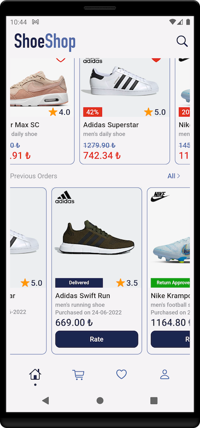
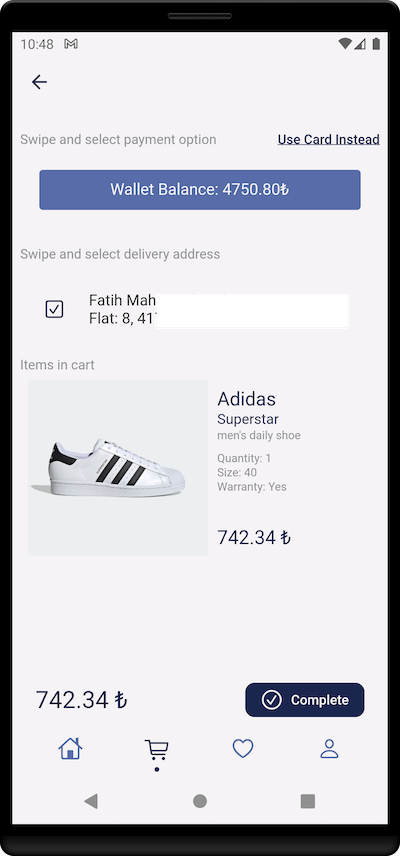
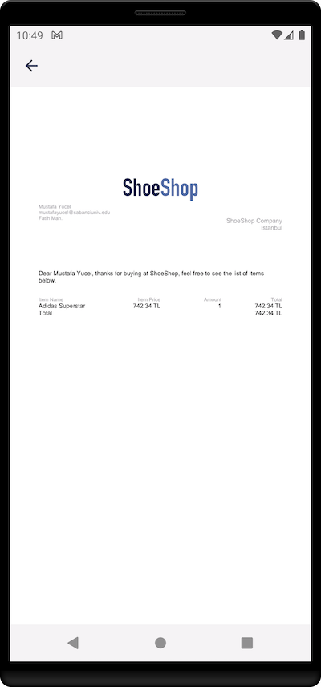
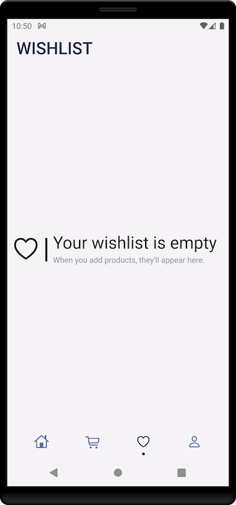

# ShoeShop Flutter Project
## Table of contents
- [ShoeShop Flutter Project](#shoeshop-flutter-project)
  - [Table of contents](#table-of-contents)
  - [Introduction](#introduction)
  - [Built with](#built-with)
  - [Screenshots](#screenshots)
    - [Login Page](#login-page)
    - [Home Tab](#home-tab)
    - [Cart Tab](#cart-tab)
    - [Wishlist Tab](#wishlist-tab)
    - [Account Tab](#account-tab)

## Introduction

Developed in line with the needs of Sabancı University's Software Engineering course coded as CS308. It is the mobile application of a fictitious e-commerce company called ShoeShop and offers nearly all the features of an e-commerce application in today's standards:

- Searching/filtering by brand, category, description or name
- Getting email notifications when a favourited product is dicounted (via Firebase Functions)
- Give ratings with/without comment
- View status of a purchased product: Processing, In-delivery, Delivered, Return Requested/Approved/Rejected
- Edit payment methods and addresses
- Get invoice as an email after purchase (via Firebase Functions)
- Change name/password

## Built with

- [Flutter](https://docs.flutter.dev) - Allows app to run both in iOS and Andriod
- [Firebase](https://firebase.google.com/docs?gclid=Cj0KCQjw4omaBhDqARIsADXULuXuTpLQQkL15zPUfN69XWRSo-FpbzapCVEpCZ6yyQX7rFEn06C2v1gaAgPpEALw_wcB&gclsrc=aw.ds) - Realtime database
- [node.js](https://nodejs.org/en/docs/) - Environment for backend functions of Firebase

## Screenshots

### Login Page

|   <b>Login Page</b>        |   <b>Sign Up Page</b>            |
|   :--:                                |   :--:                                 |
|     |     |

|   <b>Password Reset Page</b>                  |   <b></b>                     |
|   :--:                                |   :--:                                 |
|       |        |

### Home Tab

|   <b>Home Page Scroll View</b>        |   <b>End of Scroll View</b>            |
|   :--:                                |   :--:                                 |
|     |     |

|   <b>Search View</b>                  |   <b>Rate View</b>                     |
|   :--:                                |   :--:                                 |
|       |        |

|   <b>Shop Page</b>                    |   <b>Product Page</b>                  |
|   :--:                                |   :--:                                 |
|     |   |

|   <b>Product Page</b>                    |   <b>Adding to Cart</b>                  |
|   :--:                                |   :--:                                 |
|     |   |

### Cart Tab

|   <b>Empty Cart View</b>        |   <b>Cart View</b>            |
|   :--:                                |   :--:                                 |
|     |     |

|   <b>Checkout Using Credit Card</b>                  |   <b>Checkout Using Wallet</b>                     |
|   :--:                                |   :--:                                 |
|       |        |

|   <b>Checkout Completed</b>                    |   <b>Invoice View</b>                  |
|   :--:                                |   :--:                                 |
|     |   |

### Wishlist Tab

|   <b>Empty Wishlist View</b>                    |   <b>Wishlist View</b>                  |
|   :--:                                |   :--:                                 |
|     |   |

### Account Tab

|   <b>Account Settings View</b>                    |   <b>Payment Options View</b>                  |
|   :--:                                |   :--:                                 |
|     |   |